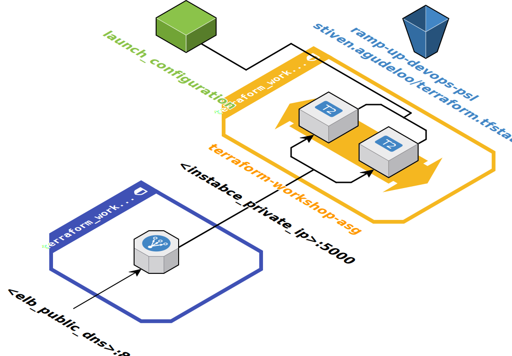

# AWS Terraform Workshop

Examples about Infrastructure as Code, using [Terraform](https://www.terraform.io/) and [AWS](https://aws.amazon.com/)

Sample application: [Hello From](https://github.com/facevedom/hello-from)

## Infrastructure


## Getting Started
### Set up your local environment
- [Install Terraform](https://www.terraform.io/intro/getting-started/install.html)
- Install AWS CLI. If you have Pip, just run 
```
pip install awscli
```
- Configure AWS CLI with your AWS credentials
```
aws configure
```
- Clone this repository
- (Optional) install and use [Landscape](https://github.com/coinbase/terraform-landscape)

## [State 1](./state_1)
- HCL
- Provider
- Resource
- Init
- Plan
- Apply
- EC2 instance
- Security group
- State
- Local tfstate
- Destroy
- User data

## [State 2](./state_2)
- Remote backend
- Data source
- Local Values
- Count

## [State 3](./state_3)
- A launch configuration
- An autoscaling group
- An ELB
- Variables
- Variables file
- Output values
- Lists and Maps

## [State 4](./state_4)
- Environments
- Modules